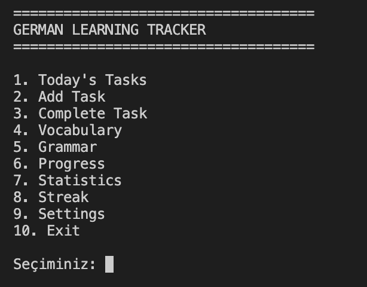
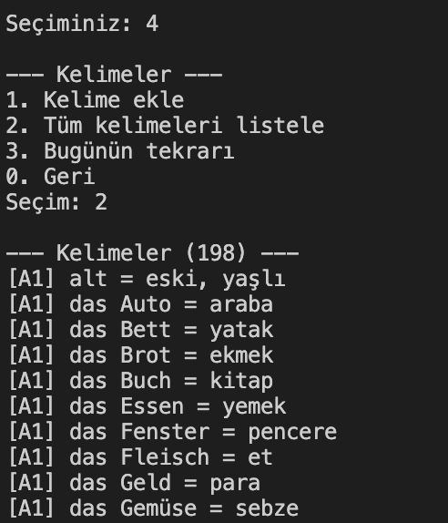
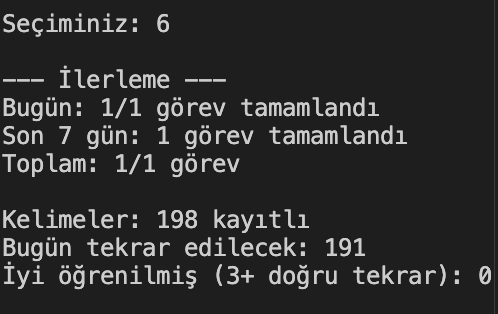

# German Learning Tracker

**English** | [Türkçe](README.tr.md)

A terminal application for tracking German learning progress. Daily tasks,
spaced-repetition vocabulary review, grammar topics, progress statistics, and
streak tracking are all managed from a single menu. All data is stored locally
in a SQLite database.

## Screenshots

**Main menu**



**Vocabulary review**



**Statistics**



## Features

| Menu             | Feature                                                         |
| ---------------- | --------------------------------------------------------------- |
| 1. Today's Tasks | Lists today's tasks                                             |
| 2. Add Task      | Adds a task with a category, level, and difficulty              |
| 3. Complete Task | Marks a task as completed                                       |
| 4. Vocabulary    | Add and list words, plus spaced-repetition review               |
| 5. Grammar       | Grammar topics by level, completion tracking, and level summary |
| 6. Progress      | Daily and weekly task counts and vocabulary progress            |
| 7. Statistics    | Category and level breakdown, recall rate, most active day      |
| 8. Streak        | Current and longest streak of consecutive study days            |
| 9. Settings      | Change the daily vocabulary review limit                        |
| 10. Exit         | Quit the app                                                    |

### Vocabulary review (spaced repetition)

Each time you recall a word correctly, its next review interval grows: 1, 3, 7,
14, and then 30 days. A word you fail to recall comes back the next day. The
number of reviews per day is capped by a limit (default 20, adjustable in the
Settings menu). Every review is recorded in the `review_log` table.

### Streak

A day counts as a study day if at least one task was completed **or** at least
one vocabulary review was done. If you have not studied yet today, your streak
is not broken; counting continues from yesterday.

## Getting started

Requirements: **Python 3.9 or newer**. No external packages are needed, the app
uses only the Python standard library.

```bash
python3 main.py
```

On first launch, the `data/german_learning.db` database and its tables are
created automatically.

### Loading starter data (optional)

To load ready-made vocabulary and grammar lists for levels A1, A2, and B1:

```bash
python3 seed_vocabulary.py   # about 190 words
python3 seed_grammar.py      # 44 grammar topics
```

Both scripts are safe to run more than once; entries that already exist are
skipped.

## Project structure

```
.
├── main.py                  # Terminal menu and user interaction
├── config.py                # Constants (paths, title, default limit)
├── database.py              # SQLite connection and table creation
├── models.py                # Shared enums: Level, TaskCategory, Difficulty
├── seed_vocabulary.py       # Loads starter vocabulary
├── seed_grammar.py          # Loads starter grammar topics
├── screenshots/             # Screenshots used in this README
├── data/                    # The SQLite database file is created here
└── services/
    ├── task_service.py          # Add, list, and complete tasks
    ├── vocabulary_service.py    # Words and spaced-repetition scheduling
    ├── grammar_service.py       # Grammar topics and level summary
    ├── review_service.py        # Vocabulary review history (review_log)
    ├── progress_service.py      # Task and vocabulary progress summary
    ├── statistics_service.py    # Statistics calculations
    ├── streak_service.py        # Streak calculations
    └── settings_service.py      # Persistent settings
```

Design rule: `main.py` only handles the menu, reads user input, and prints
output. All database work lives in the files under `services/`.

## Database tables

| Table            | Purpose                                                     |
| ---------------- | ----------------------------------------------------------- |
| `tasks`          | Daily tasks (category, level, difficulty, date, completion) |
| `vocabulary`     | Words, review count, and next review date                   |
| `grammar_topics` | Grammar topics by level and their completion status         |
| `review_log`     | A record of every vocabulary review                         |
| `settings`       | Persistent settings (for example, the daily review limit)   |

Levels (A1 to C1), task categories, and difficulty values come from the enums
in `models.py` and are also enforced in the database as CHECK constraints.

## Development phases

- **PHASE 1:** Menu skeleton
- **PHASE 2:** SQLite database
- **PHASE 3:** Task system
- **PHASE 4-5:** Vocabulary, progress, and streak
- **PHASE 6:** Grammar system
- **PHASE 7:** Review history and statistics
- **PHASE 8:** Settings

## Ideas and known gaps

- Delete and edit tasks and words
- Word search
- Database backup
- Vocabulary and grammar lists for B2 and C1
